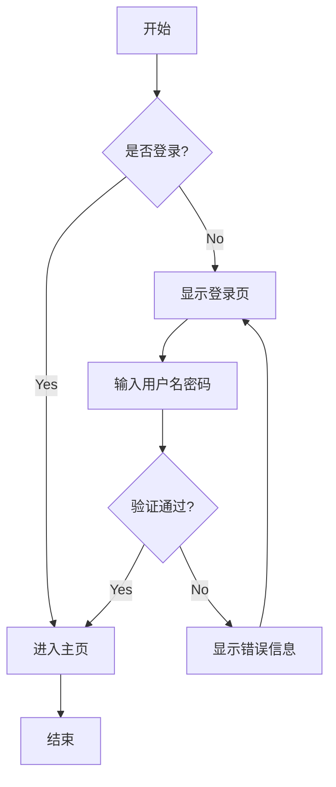
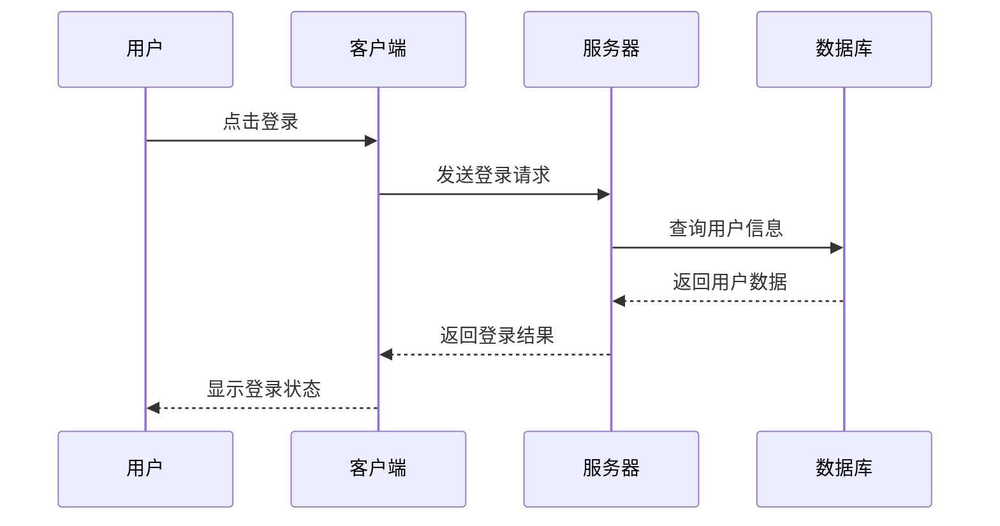
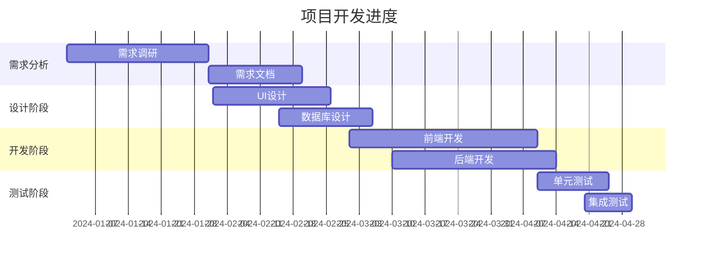
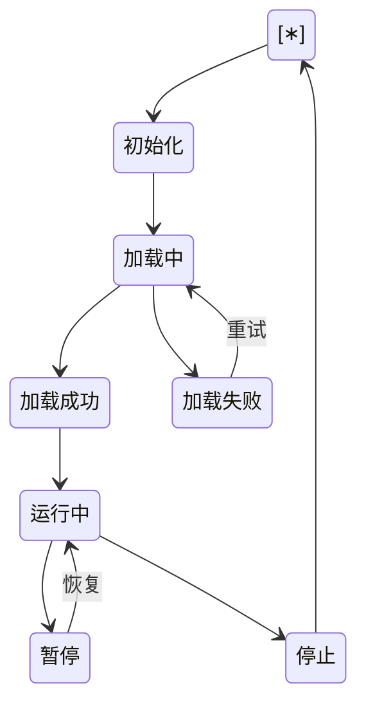
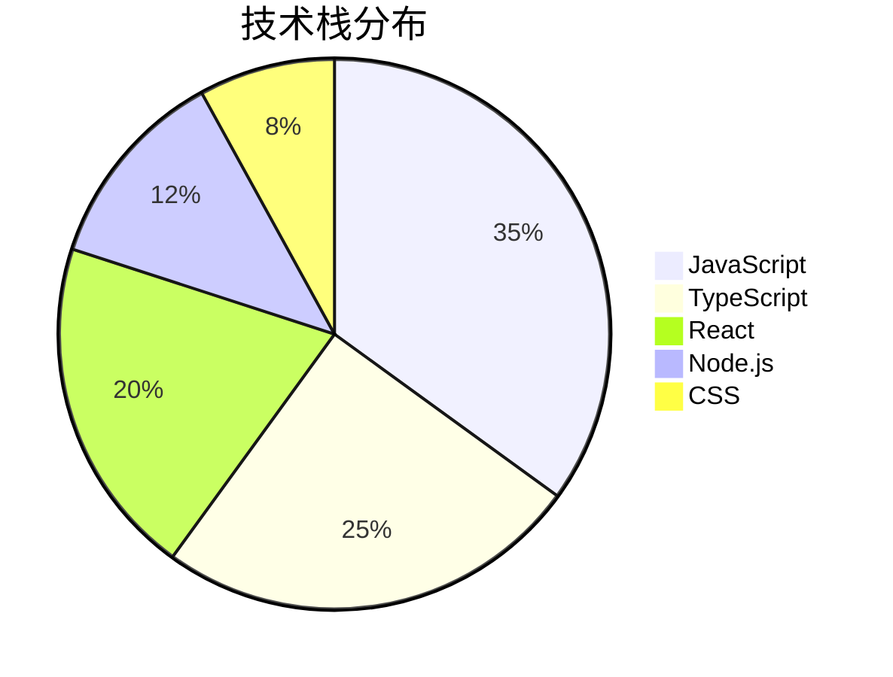

# 渲染案例

这个文件包含了所有支持的 Markdown 语法，用于测试渲染效果。测试包括基础语法、扩展语法、图表、数学公式等。

## 📋 功能测试清单

- ✅ **基础语法**：标题、段落、强调、链接、图片
- ✅ **列表**：有序、无序、任务列表
- ✅ **代码**：行内代码、代码块、语法高亮
- ✅ **表格**：基础表格、对齐方式
- ✅ **引用块**：简单引用、嵌套引用
- ✅ **扩展功能**：脚注、定义列表、缩写
- ✅ **数学公式**：行内公式、块级公式（KaTeX）
- ✅ **图表**：Mermaid 流程图、时序图等
- ✅ **特殊格式**：高亮文本、键盘按键、表情符号
- ✅ **HTML 支持**：嵌入 HTML、详情展开

---

## 1. 标题 Headers


## 2. 文本格式 Text Formatting

**粗体文本 Bold**  
*斜体文本 Italic*  
***粗斜体文本 Bold and Italic***  
~~删除线文本 Strikethrough~~  
`行内代码 Inline Code`

## 3. 链接 Links

[普通链接 Link](https://github.com)  
[带标题的链接 Link with Title](https://github.com "GitHub")  
<https://automatic-link.com>

## 4. 图片 Images


## 5. 列表 Lists

### 无序列表 Unordered List
- 列表项 1
- 列表项 2
  - 嵌套项 2.1
  - 嵌套项 2.2
    - 深层嵌套 2.2.1
- 列表项 3

### 有序列表 Ordered List
1. 第一项
2. 第二项
   1. 嵌套有序项 2.1
   2. 嵌套有序项 2.2
3. 第三项

### 任务列表 Task List (GFM)
- [x] 已完成任务
- [ ] 待完成任务
- [x] ~~已完成并删除的任务~~
- [ ] 待完成任务

## 6. 引用 Blockquotes

> 💬 **简单引用**：这是一个简单的引用块。

> 📦 **复杂引用**：这是一个多行的引用块。
> 
> 可以包含**粗体**和*斜体*文本。
> 
> > 🔄 **嵌套引用**：这是嵌套的引用块。
> > 
> > 嵌套引用可以展示更深层次的内容结构。

> ⚠️ **重要提示**：
> 
> 这里展示了引用块的各种用法，包括：
> - 简单文本引用
> - 包含格式化的引用
> - 嵌套引用结构

## 7. 代码块 Code Blocks

### 行内代码
这是一个包含 `console.log('Hello World')` 的段落。

### 代码块（无语言）
```
function hello() {
  console.log('Hello, World!');
}
```

### JavaScript 代码块
```javascript
const greeting = 'Hello, World!';
console.log(greeting);

function add(a, b) {
  return a + b;
}

const result = add(5, 3);
console.log(`5 + 3 = ${result}`);
```

### Python 代码块
```python
def fibonacci(n):
    if n <= 1:
        return n
    return fibonacci(n-1) + fibonacci(n-2)

# 计算前10个斐波那契数
for i in range(10):
    print(f"F({i}) = {fibonacci(i)}")
```

### TypeScript 代码块
```typescript
interface User {
  id: number;
  name: string;
  email: string;
}

class UserService {
  private users: User[] = [];

  addUser(user: User): void {
    this.users.push(user);
  }

  getUserById(id: number): User | undefined {
    return this.users.find(user => user.id === id);
  }
}
```

### JSON 代码块
```json
{
  "name": "JCodeNest-Hub-UI",
  "version": "1.0.0",
  "description": "A modern UI component library",
  "main": "index.js",
  "scripts": {
    "dev": "next dev",
    "build": "next build",
    "start": "next start"
  },
  "dependencies": {
    "react": "^19.1.0",
    "react-markdown": "^10.0.0"
  }
}
```

### CSS 代码块
```css
.markdown-container {
  max-width: 800px;
  margin: 0 auto;
  padding: 2rem;
  line-height: 1.6;
}

.code-block {
  background-color: #f6f8fa;
  border-radius: 6px;
  padding: 16px;
  overflow-x: auto;
}

.code-block.dark {
  background-color: #161b22;
  color: #e6edf3;
}
```

### HTML 代码块
```html
<!DOCTYPE html>
<html lang="zh-CN">
<head>
    <meta charset="UTF-8">
    <meta name="viewport" content="width=device-width, initial-scale=1.0">
    <title>Markdown 示例</title>
</head>
<body>
    <div class="container">
        <h1>Hello, Markdown!</h1>
        <p>这是一个 HTML 示例。</p>
    </div>
</body>
</html>
```

### SQL 代码块
```sql
-- 创建用户表
CREATE TABLE users (
    id SERIAL PRIMARY KEY,
    username VARCHAR(50) UNIQUE NOT NULL,
    email VARCHAR(100) UNIQUE NOT NULL,
    created_at TIMESTAMP DEFAULT CURRENT_TIMESTAMP
);

-- 插入示例数据
INSERT INTO users (username, email) VALUES 
('alice', 'alice@example.com'),
('bob', 'bob@example.com');

-- 查询用户
SELECT * FROM users WHERE username = 'alice';
```

## 8. 表格 Tables (GFM)

| 姓名 | 年龄 | 城市 | 职业 |
|------|------|------|------|
| 张三 | 25 | 北京 | 工程师 |
| 李四 | 30 | 上海 | 设计师 |
| 王五 | 28 | 深圳 | 产品经理 |

### 对齐方式
| 左对齐 | 居中对齐 | 右对齐 |
|:-------|:-------:|-------:|
| Left | Center | Right |
| 左 | 中 | 右 |
| L | C | R |

## 9. 水平分割线 Horizontal Rules

---

***

___

## 10. 数学公式 Math (KaTeX)

### 行内数学公式
这是一个行内公式：$E = mc^2$，还有 $x = \frac{-b \pm \sqrt{b^2-4ac}}{2a}$。

### 块级数学公式

$$
\int_{-\infty}^{\infty} e^{-x^2} dx = \sqrt{\pi}
$$

$$
\begin{aligned}
f(x) &= ax^2 + bx + c \\
f'(x) &= 2ax + b \\
f''(x) &= 2a
\end{aligned}
$$

### 矩阵
$$
\begin{pmatrix}
1 & 2 & 3 \\
4 & 5 & 6 \\
7 & 8 & 9
\end{pmatrix}
$$

### 求和公式
$$
\sum_{i=1}^{n} i = \frac{n(n+1)}{2}
$$

$$
\prod_{i=1}^{n} i = n!
$$

## 12. Mermaid 图表 Diagrams

### 流程图 Flowchart


### 时序图 Sequence Diagram


### 甘特图 Gantt Chart


### 状态图 State Diagram


### 饼图 Pie Chart


## 13. 脚注 Footnotes

这是一个带脚注的文本[^1]，还有另一个脚注[^note]。

[^1]: 这是第一个脚注的内容。
[^note]: 这是一个命名脚注的内容。

## 14. 定义列表 Definition Lists

术语1
: 这是术语1的定义

术语2
: 这是术语2的定义
: 术语2的另一个定义

## 15. 缩写 Abbreviations

HTML 是一种标记语言。
CSS 用于样式设计。
JS 是编程语言。

*[HTML]: HyperText Markup Language
*[CSS]: Cascading Style Sheets
*[JS]: JavaScript

## 16. 特殊字符和转义

\*这不是斜体\*  
\*\*这不是粗体\*\*  
\`这不是代码\`  
\# 这不是标题

特殊字符：&copy; &trade; &reg; &hellip;

## 17. 嵌入 HTML (如果启用)

<div style="background-color: #f0f8ff; padding: 1rem; border-radius: 0.5rem; border-left: 4px solid #0066cc;">
  <strong>提示：</strong> 这是一个 HTML 块，只有在启用 <code>enableRaw</code> 选项时才会渲染。
</div>

<details>
<summary>点击展开更多内容</summary>

这是折叠内容。可以包含：

- 列表项
- **格式化文本**
- `代码`

</details>

## 18. 表情符号 Emoji

😀 😃 😄 😁 😆 😅 😂 🤣  
❤️ 💙 💚 💛 🧡 💜 🖤 🤍  
👍 👎 👏 🙌 🤝 💪 🙏  
🔥 ⭐ ✨ 💫 🌟 ⚡ 💥  

## 19. 复杂嵌套示例

> ### 引用中的标题
> 
> 这是一个复杂的引用块，包含：
> 
> 1. **有序列表**
> 2. `行内代码`
> 3. [链接](https://example.com)
> 
> ```javascript
> // 引用中的代码块
> const message = "Hello from blockquote";
> console.log(message);
> ```
> 
> | 列名1 | 列名2 |
> |-------|-------|
> | 值1   | 值2   |
> 
> > 嵌套引用
> > 
> > 包含数学公式：$a^2 + b^2 = c^2$

## 20. 长文本和换行测试

这是一个很长很长的段落，用来测试文本的自动换行效果。这个段落包含了很多文字，目的是看看在不同的屏幕宽度下，文本是如何换行的。当文本超过容器宽度时，应该自动换行到下一行，而不是溢出容器。

这是另一个段落。  
这行文本后面有两个空格，应该会强制换行。  
这行也是如此。

## 21. 特殊格式测试

### 上标和下标
H~2~O 是水的化学式。  
E = mc^2^ 是爱因斯坦的质能方程。

### 高亮文本
==这是高亮文本==（现在支持！）

这里展示了==多个高亮文本==在同一段落中的==效果展示==。

### 键盘按键
按 <kbd>Ctrl</kbd> + <kbd>C</kbd> 复制  
按 <kbd>Ctrl</kbd> + <kbd>V</kbd> 粘贴  
按 <kbd>Ctrl</kbd> + <kbd>Z</kbd> 撤销  
按 <kbd>Ctrl</kbd> + <kbd>Shift</kbd> + <kbd>Z</kbd> 重做

## 22. 性能测试内容

### 大量列表项
- 项目 1
- 项目 2
- 项目 3
- 项目 4
- 项目 5
- 项目 6
- 项目 7
- 项目 8
- 项目 9
- 项目 10
- 项目 11
- 项目 12
- 项目 13
- 项目 14
- 项目 15
- 项目 16
- 项目 17
- 项目 18
- 项目 19
- 项目 20

### 大表格
| A | B | C | D | E | F | G | H | I | J |
|---|---|---|---|---|---|---|---|---|---|
| 1 | 2 | 3 | 4 | 5 | 6 | 7 | 8 | 9 | 10 |
| 11 | 12 | 13 | 14 | 15 | 16 | 17 | 18 | 19 | 20 |
| 21 | 22 | 23 | 24 | 25 | 26 | 27 | 28 | 29 | 30 |
| 31 | 32 | 33 | 34 | 35 | 36 | 37 | 38 | 39 | 40 |
| 41 | 42 | 43 | 44 | 45 | 46 | 47 | 48 | 49 | 50 |

---

## 🎉 测试完成

这个文件包含了大部分常用的 Markdown 语法，可以用来测试渲染组件的效果和性能。每个部分都有明确的标题和示例，便于检查特定功能是否正常工作。

### ✅ 测试项目检查列表

- [x] 基础文本格式化（粗体、斜体、删除线等）
- [x] 标题层级（H1-H6）
- [x] 列表支持（有序、无序、任务列表）
- [x] 链接和图片渲染
- [x] 代码块语法高亮
- [x] 表格渲染和对齐
- [x] 引用块样式
- [x] 数学公式支持（KaTeX）
- [x] Mermaid 图表渲染
- [x] 高亮文本效果
- [x] HTML 嵌入支持
- [x] 表情符号显示
- [x] 特殊字符转义

### 📊 性能指标

这个测试文件包含了：
- **22 个主要章节**
- **多种代码语言高亮**（JavaScript, Python, TypeScript, JSON, CSS, HTML, SQL）
- **6 种 Mermaid 图表类型**（流程图、时序图、类图、甘特图、状态图、饼图）
- **复杂数学公式**（矩阵、积分、求和等）
- **大型表格数据**（50个单元格）
- **长列表内容**（20+ 列表项）

> 💡 **提示**：如果某些功能没有正常显示，请检查 Markdown 组件的配置和相关插件是否正确加载。